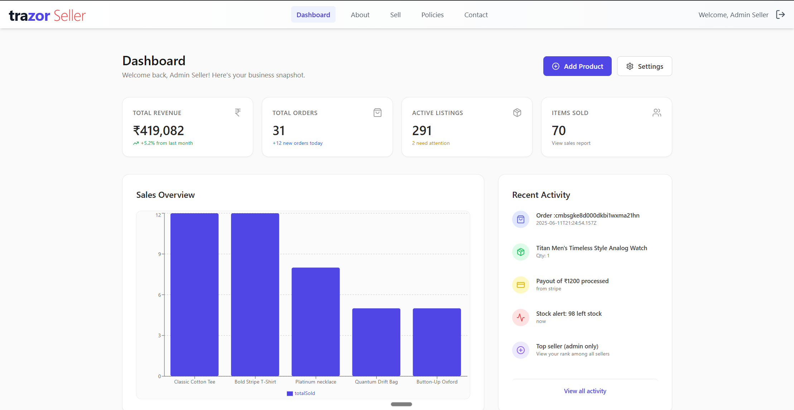
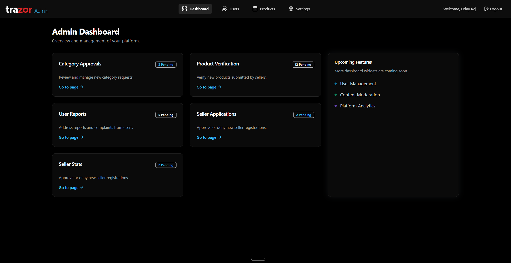

# Stocklyn

## Overview

A full-stack+Devops e-commerce application

## Progress

- Completed The full app , ready to sell

## todo ( Extra Features not required for the project as of now)

- Add an admin page for authorization of the seller's requests
- Add filters at the search and category pages.
- Quality Life Features
- Request's status at the seller
- Add an option to download SalesOverview/Insights at seller page as a report
- Add a return fucntionality on orders for max 2 days after the order
- Add coupon feature (Gambling)

## Features

- E-commerce platform with product catalog
- User authentication and authorization
- Lazy Loading
- Shopping cart functionality
- Secure checkout process
- Order management
- RBAC for sellers and buyers
- Sell Products
- Added Seller with Approval
- Added Category with Approval
- Get detailed selling stats
- Admin Dashboard
- Admin level previleges
- Admin can add/remove/edit/view users, products, categories, orders, and sellers
- Admin has full control over the app

## Tech Stack

- Frontend:
  - React.js
  - Zustand
  - React Query
  - ShadCN
  - Tailwind
  - Multer
- Backend:
  - Node.js
  - Express
  - Database (PostGres)
  - Prisma (ORM)
  - JWT Authentication
  - RBAC (Role Based Access Control)
  - RESTful API architecture
  - Docker (for development)
- Devops:
  - Shell Scripting
  - SSH
  - SSL/TLS
  - TCP/IP
  - UFW
  - Nginx(Web server)
  - Reverse Proxy (using Nginx)
  - DNS
  - PM2
  - CI operations with Git Actions

## Contributing

1. Fork the repository
2. Create your feature branch (`git checkout -b feature/amazing-feature`)
3. Commit your changes (`git commit -m 'Add amazing feature'`)
4. Push to the branch (`git push origin feature/amazing-feature`)
5. Open a Pull Request

## License

MIT License - feel free to use and modify this project for your needs.
